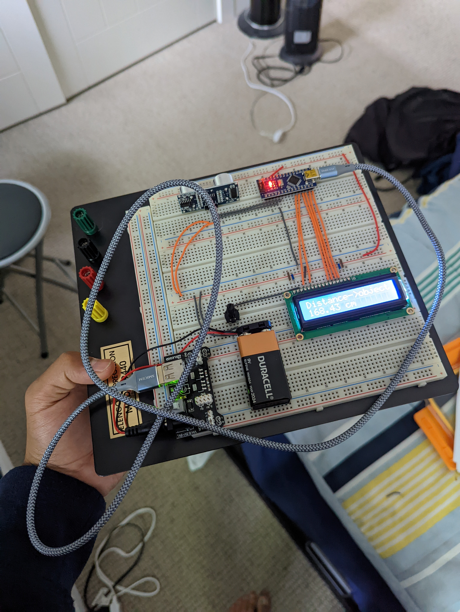

Arduino Portable Ultrasonic Distance Detector, for measuring the distance from an object to the sensor using ultrasonic time of flight. The ultrasonic sends a wave, and measures the time to receive the reflection of the wave, which is then used to calculate the distance. An LED is used to display the distance to the user, and a power supply module allows for this build to become wireless. 
Using the HC-SR04 Sensor. 

 
